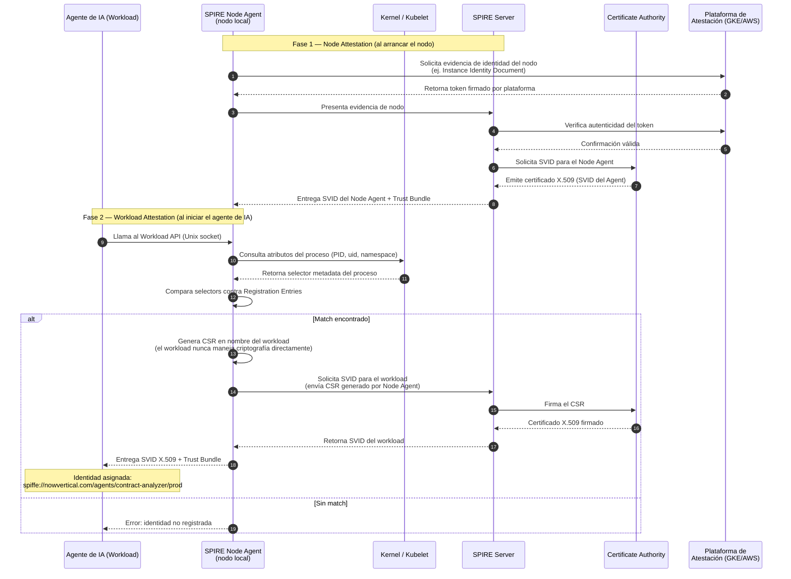
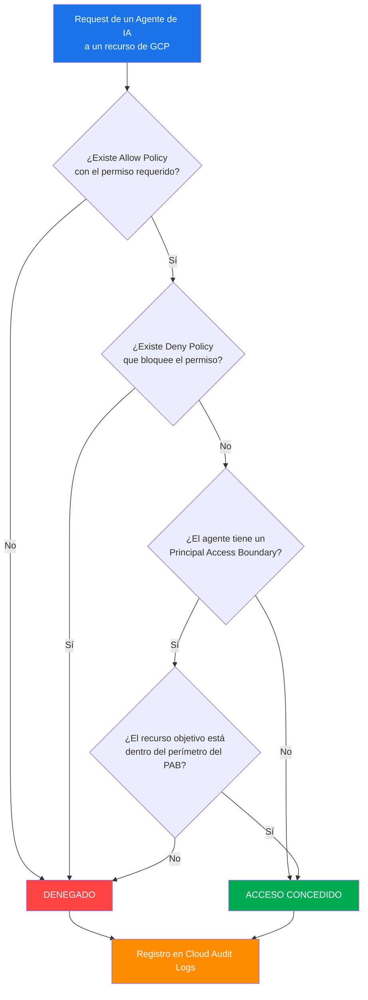
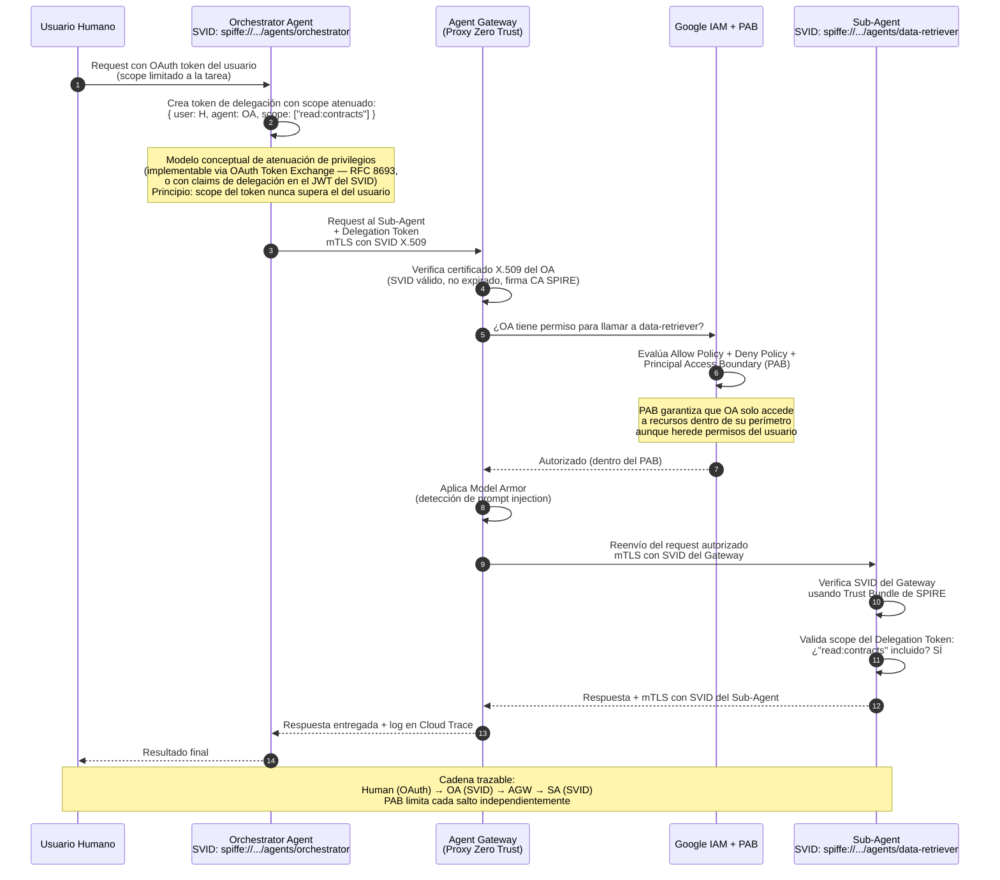

# El sistema operativo agéntico: identidad, seguridad y gobernanza en la era de los agentes de IA

Hace tres años, cuando alguien en el sector tech hablaba de "agentes de IA", en general hablaba de algo que generaba texto y lo mostraba en pantalla. El riesgo de seguridad era, en el peor caso, que alguien publicara algo incorrecto. Molesto, pero recuperable.

Hoy ese escenario es otro. En proyectos con clientes reales, los agentes reservan vuelos, actualizan registros en Salesforce, ejecutan queries sobre bases de datos de producción, invocan APIs de terceros con credenciales reales, y en algunos casos más avanzados, orquestan a otros agentes que hacen todo lo anterior. La cadena de consecuencias ya no termina en una pantalla: termina en el mundo real.

El problema es que la infraestructura que usamos para proteger esos sistemas fue diseñada para otro paradigma. Un paradigma donde los actores eran humanos o procesos batch predecibles. Los agentes no son ni una cosa ni la otra: son efímeros, dinámicos, actúan en nombre de usuarios pero con autonomía, y escalan horizontalmente de formas que ningún proceso humano puede monitorear en tiempo real.

Necesitamos, en efecto, algo parecido a un sistema operativo para el mundo agéntico. No un SO en el sentido estricto, sino una capa de primitivas equivalentes: gestión de identidad, control de acceso, auditoría, aislamiento, y ciclo de vida. Las mismas preguntas que Linux respondió para procesos, o que Kubernetes respondió para contenedores, ahora hay que responderlas para agentes que razonan, planifican y actúan.

Este artículo recorre cómo Gemini Enterprise Agent Platform y el ecosistema que la rodea ataca ese problema. Pero más importante que la plataforma específica es el razonamiento detrás: los principios que cualquier arquitecto de sistemas agénticos debería tener internalizados antes de mandar un agente a producción.

---

## El problema: por qué el modelo de seguridad clásico no alcanza

El modelo tradicional de seguridad para aplicaciones descansa en tres pilares: una service account, un secreto estático (JSON key), y una lista de permisos en IAM. Funciona razonablemente bien para servicios estáticos. Falla para agentes por razones estructurales.

En 2026, un agente de IA típico en producción puede:
- Llamar a una API externa con credenciales de la organización
- Escribir en una base de datos de clientes
- Tomar decisiones dentro de ciertos límites autorizados
- Orquestar otros agentes en pipelines multi-step
- Operar sin intervención humana durante horas o días

El escenario de riesgo no es teórico: si un agente es comprometido mediante prompt injection, si su identidad es suplantada, o si opera fuera de sus límites autorizados, las consecuencias son equivalentes a las de un empleado con acceso privilegiado actuando de forma maliciosa.

El modelo JSON key falla aquí por razones concretas: el secreto es estático, no caduca solo, puede ser copiado y filtrado en un repositorio de git, y el modelo de service account asume que los procesos son predecibles y de larga vida. Un agente puede ser instanciado miles de veces por minuto, tener una vida útil de segundos, ser un subagente invocado dinámicamente por otro agente, y desaparecer cuando su tarea termina. Darle a cada instancia una JSON key es operativamente imposible. Compartir la misma key entre todas las instancias destruye cualquier posibilidad de trazabilidad granular.

### Service Account vs. Identidad SPIFFE: la diferencia estructural

| Dimensión | Service Account clásica | Identidad SPIFFE/SVID |
|---|---|---|
| **Naturaleza del secreto** | JSON key estática, exfiltrable | Certificado X.509 de corta vida, no reusable |
| **Vinculación al runtime** | Ninguna: la key funciona desde cualquier contexto | Ligada al workload que la solicitó (proceso, pod, instancia) |
| **Rotación** | Manual o automatizada con riesgo de downtime | Automática, continua, sin intervención operativa |
| **Granularidad de identidad** | A nivel de cuenta de servicio (compartida) | Por workload individual: `spiffe://dominio/agente/instancia` |
| **Escalabilidad** | Lineal: una key por servicio, gestión manual | Declarativa: el SPIRE agent emite certs para cualquier workload registrado |
| **Exfiltración del secreto** | Compromete indefinidamente | El cert expira en horas; daño acotado temporalmente |
| **Multi-agent systems** | Identidades estáticas, difícil trazar delegación | Cadena de confianza criptográfica entre agentes |

La diferencia fundamental: una JSON key es un secreto que *tiene* el agente. Un SVID es una identidad que *prueba* el agente en tiempo real, sin secretos compartidos.

---

## SPIFFE, SVID y X.509: la criptografía que necesitás entender

SPIFFE (Secure Production Identity Framework For Everyone) parte de una premisa diferente a todo el modelo anterior: la identidad no debería estar ligada a un secreto que el proceso conoce, sino a una propiedad criptográfica del contexto de ejecución donde corre el proceso.

Es un estándar abierto (CNCF), y su implementación de referencia es SPIRE. Google construyó Agent Identity, el sistema de identidad de Gemini Enterprise Agent Platform, sobre esta base.

### La arquitectura SPIRE en tres componentes

**SPIRE Server**: autoridad central que conoce qué workloads son legítimos. Gestiona la CA interna y los "registration entries" que describen qué identidades emitir y a qué workloads.

**SPIRE Node Agent**: corre en cada nodo del cluster (DaemonSet en Kubernetes). Atestigua la identidad del nodo ante el servidor, y luego emite SVIDs a los workloads que corren en ese nodo. El agente de IA nunca habla con el SPIRE Server directamente: habla con el Node Agent local.

**Workload API**: interfaz local (socket Unix) a través de la cual un workload solicita su SVID sin necesidad de conocer credenciales. El Node Agent lo identifica por atributos del proceso (UID, PID, namespace, labels del pod, etc.).

### Anatomía de un SVID

Un SVID (SPIFFE Verifiable Identity Document) es un certificado X.509 estándar con una extensión específica en el campo **Subject Alternative Name (SAN)**:

```
spiffe://trust-domain/path/to/workload
```

Ejemplo concreto para un agente de análisis de contratos en producción:

```
spiffe://nowvertical.com/agents/contract-analyzer/prod
```

En GCP, cuando corrés un agente en Agent Runtime (Vertex AI Agent Engine), la identidad tiene la forma:

```
spiffe://agents.global.org-{ORG_ID}.system.id.goog/resources/aiplatform/projects/{PROJECT_NUMBER}/locations/{LOCATION}/reasoningEngines/{AGENT_ID}
```

El SAN tiene semántica directa: `trust-domain` define el dominio de confianza de la organización (equivalente al dominio de la CA), y el `path` describe la jerarquía del workload. Dos agentes del mismo trust domain pueden autenticarse mutuamente sin un servidor de autorización centralizado en el camino caliente.

### Cómo un agente recibe su identidad: el flujo completo



El workload lo obtiene así en código, sin manejar ninguna credencial:

```python
from spiffe import WorkloadApiClient, X509Source

# Opción recomendada para agentes long-running: fuente con renovación automática
with X509Source() as source:
    x509_svid = source.svid
    print(f"SPIFFE ID: {x509_svid.spiffe_id}")
    # x509_svid.cert_chain  → cadena de certificados PEM
    # x509_svid.private_key → clave privada asociada (en memoria, nunca en disco)
```

El workload llama a la Workload API local. El Node Agent verifica que el proceso que llama coincide con un registration entry. Si coincide, emite el SVID. El workload recibe un certificado sin haber manejado ningún secreto.

### Por qué X.509 y no tokens Bearer

Los tokens Bearer (JWT, OAuth) requieren validación contra un servidor de autorización en cada request. Un certificado X.509 se valida localmente contra la CA interna del trust domain, sin roundtrip de red. Esto importa en sistemas multi-agent con baja latencia.

Más importante: X.509 permite **mTLS (mutual TLS)** nativo. En una comunicación entre dos agentes:

1. El agente cliente presenta su SVID (cert X.509 con SAN `spiffe://...`)
2. El agente servidor verifica la firma contra la CA del trust domain
3. El servidor presenta *su propio* SVID
4. El cliente verifica la identidad del servidor de la misma manera
5. Ambos extremos están autenticados antes de intercambiar un solo byte de payload

No hay secreto compartido. No hay session token que robar. La verificación es local, usando criptografía asimétrica: el cert fue firmado por la CA interna del trust domain en quien ambos confían, y eso es suficiente sin consultar un servidor de autorización en tiempo real.

> **Nota**: SPIFFE define también los **JWT-SVID** como formato alternativo al X.509, para escenarios donde mTLS no es viable (por ejemplo, comunicación con APIs HTTP que solo soportan Bearer tokens). En ese caso el SVID es un JWT firmado por la CA del trust domain, con el `spiffe://` URI en el campo `sub`. Para la mayoría de comunicaciones agent-to-agent, X.509 con mTLS es la opción recomendada.

### TTL corto: el mecanismo de contención de daño

Los SVIDs tienen TTL configurablemente corto, típicamente entre 1 hora y 24 horas. SPIRE rota los certificados automáticamente antes del vencimiento. Las consecuencias prácticas:

- Un cert exfiltrado tiene ventana de uso mínima (horas, no días)
- SPIFFE no define un mecanismo estándar de revocación tipo CRL u OCSP: la defensa principal es el TTL corto. Para TTLs de 24 horas la ventana de daño es más amplia; recomendamos 1-4 horas para agentes de producción
- Los logs contienen la identidad exacta del agente en cada punto del tiempo, sin ambigüedad entre instancias

Si el certificado de un agente es comprometido, su ventana de utilidad para un atacante es mínima. No hay un secreto de larga vida que robar: hay un documento criptográfico que expira pronto y que fue emitido a un contexto de ejecución específico. Replicar ese contexto para obtener un nuevo cert requiere comprometer el nodo entero, que es un ataque de un orden de magnitud más difícil.

---

## Gobernanza en tiempo de ejecución

Tener identidades robustas es necesario pero no suficiente. Un agente autenticado correctamente puede hacer cosas que no debería. El siguiente nivel es el control de lo que un agente puede hacer, en tiempo real, sin depender únicamente de la configuración estática de IAM.

### Agent Gateway: el proxy como punto de control

La arquitectura de Agent Gateway es conceptualmente simple: es un proxy centralizado que intercepta todo el tráfico entre agentes, entre agentes y APIs externas, y entre agentes y los modelos de lenguaje subyacentes. Toda comunicación pasa por ahí.

Podés aplicar políticas de acceso basadas en la identidad del agente, limitar el rate de llamadas a APIs, loguear cada interacción con contexto completo, y hacer todo eso sin modificar el código del agente. Al enrutar tráfico autenticado con identidad SPIFFE, el Gateway puede aplicar políticas con granularidad de identidad de agente: quién llama, a quién llama, y con qué scopes declarados en los tokens de delegación. Esta combinación de identidad criptográfica y contexto de delegación habilita políticas del tipo "este agente actúa en nombre de este usuario" que serían imposibles de implementar con routing basado únicamente en IPs o service accounts.

### Model Armor: protección en la capa de inferencia

Prompt injection es, en este momento, uno de los vectores de ataque más subestimados en sistemas agénticos. Si un agente procesa contenido externo —emails, documentos, páginas web— ese contenido puede contener instrucciones diseñadas para manipular su comportamiento.

Model Armor opera como filtro bidireccional entre el agente y el modelo:

**Dirección entrada**: detecta intentos de prompt injection, instrucciones que buscan escalar privilegios, patrones de jailbreak.

**Dirección salida**: detecta data leakage (PII, credenciales embedidas en respuestas), valida que el output esté dentro del dominio esperado.

Lo relevante es que esto opera en la capa de infraestructura, no en la capa del modelo. No dependés de que el modelo "entienda" que está siendo atacado:

```python
from google.cloud import modelarmor_v1

def sanitize_agent_prompt(template_name: str, user_input: str) -> bool:
    """Retorna True si el prompt es seguro, False si fue bloqueado."""
    client = modelarmor_v1.ModelArmorClient()

    user_prompt_data = modelarmor_v1.DataItem()
    user_prompt_data.text = user_input

    request = modelarmor_v1.SanitizeUserPromptRequest(
        name=template_name,
        user_prompt_data=user_prompt_data,
    )

    response = client.sanitize_user_prompt(request=request)
    sanitized = response.sanitization_result

    if sanitized.filter_match_state == modelarmor_v1.FilterMatchState.MATCH_FOUND:
        return False  # bloqueado
    return True

# Uso en el pipeline del agente
template = "projects/my-project/locations/us-central1/templates/agent-security-template"
if sanitize_agent_prompt(template, user_input):
    response = model.generate_content(user_input)
```

Model Armor se configura con perfiles de riesgo por agente. Un agente de atención al cliente tiene un perfil diferente al de un agente de análisis de contratos legales.

### Principal Access Boundary: límites que no se pueden negociar

IAM heredado tiene un problema en entornos agénticos: los permisos se acumulan. Un agente que actúa en nombre de un usuario hereda, en modelos ingenuos, todos los permisos de ese usuario. Principal Access Boundary (PAB) resuelve esto con límites duros.

Un PAB define el conjunto máximo de recursos al que un principal puede acceder, independientemente de los permisos que tenga en IAM. Es una capa por encima de IAM que **no se puede escalar con grants adicionales**:

```json
// pab-rules.json — reglas reales de PAB (solo efecto ALLOW)
// PAB no tiene efecto DENY: lo que no está en el ALLOW está implícitamente fuera del perímetro
[
  {
    "description": "El agente solo puede acceder a recursos de customer-data-prod",
    "resources": [
      "//cloudresourcemanager.googleapis.com/projects/customer-data-prod"
    ],
    "effect": "ALLOW"
  }
]
```

La palabra clave es "duro": aunque alguien asigne manualmente un rol de Owner al agente en un recurso fuera de su PAB, el acceso es denegado. PAB solo define perímetros de ALLOW — lo que no está permitido explícitamente queda fuera del alcance del agente, sin necesidad de reglas de denegación explícitas.

```bash
# Crear PAB policy y vincularla al agente
gcloud iam principal-access-boundary-policies create agent-pab-policy \
    --organization=123456789012 \
    --location=global \
    --display-name="PAB para agente de análisis" \
    --details-rules=pab-rules.json

gcloud iam policy-bindings create agent-pab-binding \
    --organization=123456789012 \
    --location=global \
    --policy="organizations/123456789012/locations/global/principalAccessBoundaryPolicies/agent-pab-policy" \
    --target-principal-set="principalSet://iam.googleapis.com/projects/9876543210/locations/global/workloadIdentityPools/POOL_ID/subject/AGENT_SUBJECT_ID"
```

La lógica de evaluación de IAM con PAB:



La implicancia práctica: podés diseñar un sistema donde un agente de procesamiento de documentos, aunque esté autenticado con una cuenta con permisos amplios, nunca pueda acceder a recursos fuera de su dominio definido. El límite está en la arquitectura del sistema, no en la disciplina de quien configura IAM.

### El flujo completo: autorización mTLS en una cadena multi-agente



---

## Ciclo de vida del agente: construcción, secretos y escala

La seguridad no empieza cuando el agente corre. Empieza cuando se construye.

### ADK: el framework que separa la lógica del runtime

Agent Development Kit es el framework de Google para construir agentes. Su diseño modular y agnóstico al modelo tiene implicancias de seguridad directas: el scope de lo que un agente puede hacer está definido en código, en forma de herramientas declaradas explícitamente. Auditar el agente es auditar su lista de herramientas.

El agente no está acoplado a un LLM específico: el modelo es un parámetro de configuración. Si el modelo subyacente es la superficie de ataque más nueva y menos entendida, aislar la lógica del agente de esa variabilidad es una decisión de arquitectura defensiva.

### Secret Manager con identidad agéntica

Esta es una de las preguntas que aparece siempre en proyectos: si el agente necesita llamar una API de terceros con una API key, ¿cómo accede a esa key de forma segura?

La respuesta correcta en el ecosistema agéntico: el agente se autentica ante Secret Manager usando su identidad SPIFFE, y Secret Manager le devuelve el secreto solo si el agente tiene el rol IAM correspondiente. Sin JSON keys, sin variables de entorno bakeadas en la imagen, sin secretos en repositorios:

```python
from google.cloud import secretmanager

def get_secret_via_agent_identity(project_id: str, secret_id: str) -> str:
    """
    El cliente usa automáticamente las credenciales del workload
    (Agent Identity / Workload Identity Federation).
    No se pasa ninguna credencial explícita.
    """
    client = secretmanager.SecretManagerServiceClient()
    name = f"projects/{project_id}/secrets/{secret_id}/versions/latest"
    response = client.access_secret_version(request={"name": name})
    return response.payload.data.decode("UTF-8")

# En un agente corriendo en Agent Engine, esto simplemente funciona.
# El runtime inyecta la identidad; el agente la usa para obtener el secreto.
api_key = get_secret_via_agent_identity("my-project", "third-party-api-key")
```

La cadena de confianza es: runtime de Agent Engine → identidad criptográfica → rol IAM en Secret Manager → secreto. El secreto no viaja con el agente: el agente va a buscarlo en runtime, con una identidad que expira.

### Agent Engine: runtime gestionado como contrato de seguridad

Agent Engine abstrae la infraestructura de ejecución. Para el desarrollador, es un runtime donde deployás tu agente. Para la plataforma, es el componente que garantiza aislamiento, gestiona el ciclo de vida de la identidad, aplica las políticas de red, y provee el punto de integración con el resto del ecosistema.

El aislamiento entre instancias no es una propiedad que configurás: es una garantía del runtime. Dos instancias del mismo agente no comparten estado, no comparten credenciales, y tienen identidades criptográficas distintas. La escala horizontal no diluye la seguridad.

Para deployar un agente con Agent Identity habilitada:

```python
import vertexai
from vertexai import types
from vertexai.agent_engines import AdkApp

client = vertexai.Client(
    project="my-project-id",
    location="us-central1",
    http_options=dict(api_version="v1beta1")
)

remote_app = client.agent_engines.create(
    agent=AdkApp(agent=my_adk_agent),
    config={
        "identity_type": types.IdentityType.AGENT_IDENTITY,
        "requirements": [
            "google-cloud-aiplatform[agent_engines,adk]",
            "google-adk[agent-identity]"
        ],
    },
)
# El agente recibe automáticamente un SVID con el ID:
# spiffe://agents.global.org-{ORG_ID}.system.id.goog/resources/aiplatform/...
```

---

## Cumplimiento regulatorio: auditoría con contexto real

GDPR, HIPAA, SOC 2: todos estos marcos tienen una pregunta core que es cada vez más difícil de responder en sistemas agénticos: "¿Quién accedió a qué dato y por qué?"

En sistemas tradicionales, la respuesta es relativamente directa: el log muestra qué usuario o proceso accedió a qué recurso. En sistemas agénticos, la cadena es más compleja: accedió el agente de procesamiento de documentos, que fue invocado por el agente orquestador, que fue invocado por el usuario X, para completar la tarea Y.

Cloud Audit Logs con identidad SPIFFE captura esa cadena completa:

```json
{
  "principalEmail": "spiffe://nowvertical.com/agents/contract-agent/prod",
  "delegatedUser": "user@empresa.com",
  "action": "storage.objects.create",
  "resource": "projects/legal-docs-prod/buckets/contracts/objects/contract-2026-001.pdf",
  "timestamp": "2026-06-11T14:32:01Z",
  "sessionId": "ag-sess-abc123",
  "parentAgent": "spiffe://nowvertical.com/agents/orchestrator/prod"
}
```

El campo `parentAgent` es crítico en sistemas multi-agent: permite reconstruir la cadena de delegación completa. Si un agente subordinado realiza una acción problemática, la auditoría puede trazar quién lo orquestó y en nombre de quién.

Para GDPR (Art. 22), esto habilita responder requests de auditoría con granularidad real sobre decisiones automatizadas con impacto significativo. Para HIPAA, permite demostrar que el acceso a datos clínicos siempre fue autorizado, registrado, y limitado al mínimo necesario: el log tiene el `delegatedUser` (médico o administrador que autorizó la acción) y el `parentAgent` (el orquestador que inició la cadena).

La explicabilidad —XAI— agrega otra dimensión: los frameworks como ADK pueden capturar el chain-of-thought del agente junto con cada acción, convirtiendo el log de auditoría en un registro del proceso de decisión, no solo del resultado. Cada tool call es un evento estructurado que puede enviarse a Cloud Logging automáticamente.

---

## Integraciones avanzadas: Auth0 y autorización de grano fino

El escenario más interesante —y más complejo— es cuando el agente actúa en nombre de un usuario humano que se autenticó con un identity provider externo como Auth0.

El flujo: el usuario se autentica via Auth0, que emite un token OAuth2/OIDC. Ese token viaja con la solicitud al agente orquestador. El agente usa ese token para federar la identidad del usuario con el sistema IAM de GCP, estableciendo el contexto de "este agente actúa en nombre de este usuario específico".

Lo que agrega Fine-Grained Authorization (FGA, inspirado en Zanzibar) es la capacidad de expresar políticas mucho más granulares. FGA trabaja con grafos de relaciones:

```
# El agente puede leer documentos que el usuario tiene permiso de leer
agent:contract-agent#can_read <- user:alice#can_read
# Pero no puede firmar documentos (requiere confirmación humana explícita)
agent:contract-agent#can_sign <- DENIED
```

El patrón más poderoso es el FGA Retriever en pipelines RAG: el agente verifica, documento por documento, si el usuario tiene acceso antes de incluirlo en el contexto:

```python
from langchain_community.vectorstores import FAISS
from openfga_sdk.client.models import ClientBatchCheckItem
from auth0_ai_langchain import FGARetriever

def agent_retrieve_context(query: str, user_id: str, documents: list) -> str:
    """
    Recupera contexto solo de documentos a los que el usuario tiene acceso.
    El agente NO puede devolver docs que el usuario no puede ver.
    """
    vector_store = FAISS.from_documents(documents, OpenAIEmbeddings())

    retriever = FGARetriever(
        retriever=vector_store.as_retriever(),
        build_query=lambda doc: ClientBatchCheckItem(
            user=f"user:{user_id}",
            object=f"doc:{doc.metadata['id']}",
            relation="viewer",
        ),
    )

    # Solo retorna docs donde FGA confirma que user:USER puede ver doc:DOC_ID
    relevant_docs = retriever.invoke(query)
    return "\n\n".join([doc.page_content for doc in relevant_docs])
```

La implicancia práctica: podés construir sistemas donde el agente tiene acceso a una API solo cuando el usuario que lo invocó es dueño del recurso, o es miembro de un equipo con permiso específico, o la solicitud fue aprobada por un workflow previo. Esa granularidad es imposible de expresar en IAM tradicional sin explotar en una cantidad inmanejable de roles customizados.

---

## Recomendaciones accionables

Para equipos construyendo o migrando sistemas agénticos, el orden de adopción recomendado:

### Nivel 1: Identidad (adopción inmediata)
- Migrar de service accounts con JSON keys a identidad SPIFFE/SPIRE o Agent Identity de GCP
- Configurar TTL de SVIDs en máximo 4 horas para agentes de producción
- Eliminar toda credential estática del código y variables de entorno de agentes

### Nivel 2: Control de acceso (primer mes)
- Desplegar Agent Gateway como punto de entrada único para todos los agentes
- Definir PABs explícitos para cada agente, comenzando con los de mayor privilegio
- Activar Model Armor en modo logging (sin bloqueo) para establecer baseline de comportamiento normal

### Nivel 3: Auditoría y delegación (primer trimestre)
- Estructurar Cloud Audit Logs con campos `delegatedUser` y `parentAgent`
- Integrar el IdP existente (Auth0, Okta, Google Workspace) para delegación de identidad humana
- Implementar FGA para agentes que operan con datos sensibles o toman decisiones con impacto

### Nivel 4: Cumplimiento (antes del primer audit externo)
- Habilitar retención de logs según requerimientos regulatorios (GDPR: mínimo por acción con impacto, HIPAA: 6 años)
- Implementar logging de chain-of-thought para agentes con decisiones de impacto
- Documentar el modelo de amenaza específico de cada agente: qué puede hacer, qué no puede hacer, cómo se detecta una anomalía

---

## El sistema operativo agéntico: por qué el nombre importa

Uso intencionalmente ese término porque creo que es la analogía correcta para lo que está pasando.

Cuando Linux apareció, resolvió el problema de gestionar múltiples procesos que comparten recursos y necesitan aislamiento entre sí. Con primitivas concretas: PIDs, users, file permissions, namespaces. Cuando Kubernetes apareció, resolvió el problema de gestionar múltiples contenedores con orquestación y resiliencia. También con primitivas concretas: Pods, Services, RBAC, NetworkPolicies.

Los agentes de IA representan una nueva clase de entidades computacionales que necesitan su propio conjunto de primitivas. No pueden simplemente heredar las de los sistemas anteriores porque tienen propiedades que esos sistemas no anticiparon: razonan, improvisan, actúan en nombre de otros, producen consecuencias que no son deterministicamente predecibles de su configuración inicial.

El mapa del sistema operativo agéntico emergente:

| Componente SO clásico | Equivalente agéntico |
|---|---|
| Subsistema de identidad de proceso | SPIFFE/SPIRE · Agent Identity |
| Kernel que media acceso al hardware | Agent Gateway |
| Sistema de permisos y capacidades | PAB + IAM |
| Firewall de red | Model Armor |
| Log del sistema | Cloud Audit Logs con cadena de delegación |
| Runtime y scheduler | ADK + Agent Engine |
| Gestión de secretos del proceso | Secret Manager con Workload Identity |

Este sistema operativo agéntico no es opcional en 2026. Los agentes que operan sin él son el equivalente de correr procesos de usuario con privilegios de root sin separación de memoria: funciona hasta que no funciona, y cuando falla, falla catastrófico.

La diferencia con el SO clásico es que aquí los procesos razonan, generan outputs no deterministas, y pueden ser manipulados a través del lenguaje natural. Eso eleva el modelo de amenaza. Y también define el alcance del trabajo de seguridad que todavía queda por delante: ¿cómo formalizamos la autorización de una cadena de razonamiento, no solo de una acción discreta? ¿Cómo manejamos los ataques de prompt injection de segunda generación, los que son suficientemente sofisticados para evadir filtros estáticos?

Esas preguntas no tienen respuestas definitivas hoy. Pero la forma en que las hacemos revela si entendemos el problema real o si estamos proyectando el problema de ayer sobre el sistema de mañana.

---

## Para llevarse

No estoy vendiendo una plataforma. Estoy pasando el mapa mental que uso cuando audito arquitecturas agénticas en clientes.

Las preguntas que deberían quitar el sueño antes de mandar un agente a producción:

**Sobre identidad**: ¿Podés identificar criptográficamente cada instancia de cada agente en cada momento? Si la respuesta depende de un secreto estático compartido, el modelo de identidad es frágil.

**Sobre autorización**: ¿Los permisos del agente están limitados al mínimo necesario para su tarea, independientemente de los permisos del usuario que lo invocó? Si no, tenés escalamiento de privilegios por diseño.

**Sobre auditoría**: ¿Podés responder "quién autorizó esta acción sobre este dato, en qué momento, y en nombre de quién" para cualquier acción que el agente tomó en las últimas 24 horas? Si esa pregunta tarda más de un minuto en responderse, el sistema no es auditable en producción.

**Sobre el canal del modelo**: ¿Tenés protección contra prompt injection que no dependa únicamente del propio modelo resistiendo el ataque? Los modelos grandes son notablemente susceptibles a ataques bien crafteados.

**Sobre el blast radius**: Si este agente es comprometido completamente, ¿cuánto daño puede hacer antes de que lo detectes? La respuesta debería ser acotada y predecible.

El mundo agéntico no es el futuro. Es el presente en el que muchos de nosotros ya trabajamos. La diferencia entre los sistemas que van a resistir y los que van a generar los próximos grandes incidentes de seguridad probablemente pase por estas decisiones de arquitectura, tomadas ahora, con el conocimiento disponible hoy.

La capa de seguridad tiene que estar desde el diseño. No como una feature de la siguiente iteración.

---

*Matías Zabaljáuregui es Agentic AI Lead en el Centro de Excelencia de IA de NowVertical. Trabaja en diseño e implementación de sistemas agénticos para empresas en producción en América Latina y Europa.*
